<div align="center">

# 陳犀牛 · Chen XiNew

### 用好奇心探索世界，用知識改變未來！

**知識 · 探索 · 改變　|　EXPLORE · LEARN · IMPACT**

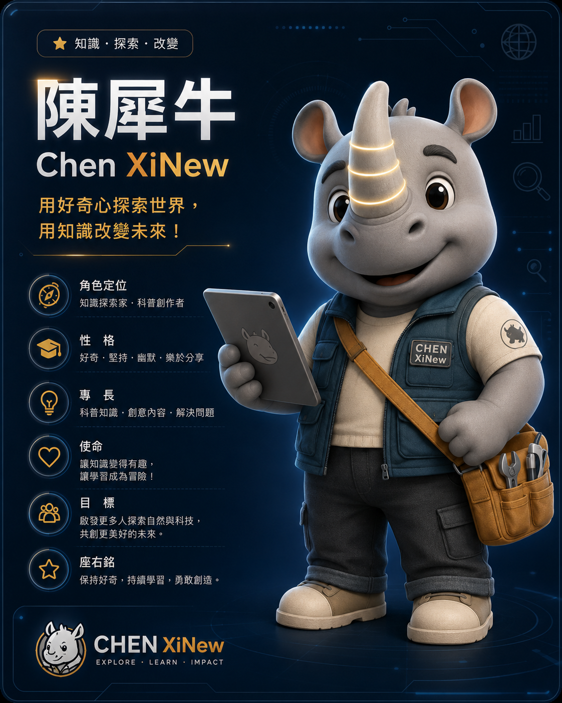

</div>

---

## 目錄 Table of Contents

- [角色簡介 Overview](#角色簡介-overview)
- [角色檔案 Character Profile](#角色檔案-character-profile)
- [品牌識別 Brand Identity](#品牌識別-brand-identity)
- [角色故事 Story & Worldbuilding](#角色故事-story--worldbuilding)
- [內容策略 Content Strategy](#內容策略-content-strategy)
- [主題曲 Theme Song](#主題曲-theme-song)
- [設計資產索引 Asset Index](#設計資產索引-asset-index)
- [檔案樹 File Tree](#檔案樹-file-tree)
- [使用指引 Usage Guidelines](#使用指引-usage-guidelines)

---

## 角色簡介 Overview

**陳犀牛（Chen XiNew）** 是一位以「知識探索家 / 科普創作者」為定位的原創 IP 角色。他是一隻親切、好奇心旺盛的犀牛，穿著工裝背心、揹著工具包、手拿平板，象徵著「動手實作 × 科技探索」的精神。

角色的核心理念是把艱深的知識變得有趣，讓學習成為一場冒險。無論是科學、科技、生活智慧、旅行冒險還是創意挑戰，陳犀牛都以熱情、幽默又可靠的方式帶領觀眾一起「發現問題、解決問題，然後讓世界更好」。

> 本專案為陳犀牛 IP 的**設計資產庫（Design Asset Library）**，統一收錄品牌識別、角色設定、內容策略、周邊設計與**主題曲音檔／歌詞**等素材，方便後續在影片、社群、商品與合作提案中引用。

---

## 角色檔案 Character Profile

| 項目 Field | 內容 Detail |
|---|---|
| **中文名 Name (ZH)** | 陳犀牛 |
| **英文名 Name (EN)** | Chen XiNew |
| **生日 Birthday** | 2015 / 05 / 20 |
| **物種 Species** | 犀牛 Rhinoceros |
| **角色定位 Role** | 知識探索家 · 科普創作者（Knowledge Explorer · Educational Creator） |
| **性格 Personality** | 好奇 · 堅持 · 幽默 · 樂於分享 |
| **專長 Expertise** | 科普知識 · 創意內容 · 解決問題 |
| **使命 Mission** | 讓知識變得有趣，讓學習成為冒險！ |
| **目標 Goal** | 啟發更多人探索自然與科技，共創更美好的未來 |
| **座右銘 Motto** | 保持好奇，持續學習，勇敢創造 |
| **口頭禪 Catchphrase** | 「發現問題，解決問題，然後讓世界更好！」 |

### 造型特徵 Design Notes

- **發光犀牛角**：金黃色分節的角，是角色的視覺記憶點，象徵「靈感」與「探索之光」。
- **工裝背心 + 側背工具包**：代表動手實作、務實可靠的探索家形象；胸前配有 `CHEN XiNew` 名牌，肩上有犀牛剪影臂章。
- **手持平板**：連結科技與知識傳播的日常工具。
- **暖色工作靴與捲邊工裝褲**：親和、接地氣的日常穿搭。

> 造型三視圖、表情設定請見 [設計資產索引](#設計資產索引-asset-index)。

---

## 品牌識別 Brand Identity

<div align="center">
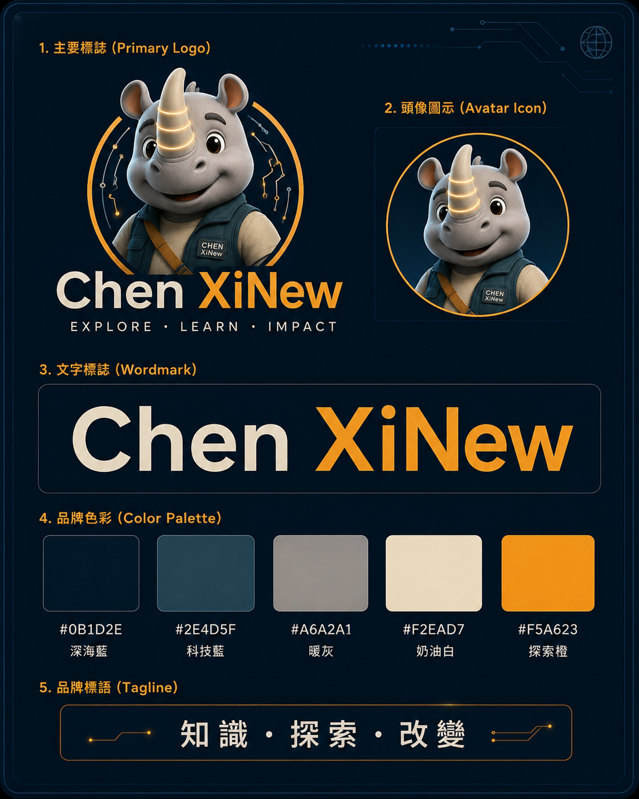
</div>

### 標語系統 Taglines

| 類型 Type | 內容 |
|---|---|
| **品牌標語 Tagline** | 知識 · 探索 · 改變 |
| **英文標語 Slogan** | EXPLORE · LEARN · IMPACT |
| **主標語 Headline** | 用好奇心探索世界，用知識改變未來！ |
| **頻道口號 Channel** | Stay Curious, Keep Growing! |

### 品牌色彩 Color Palette

| 色票 | HEX | 名稱 Name | 用途建議 Usage |
|---|---|---|---|
| 🟦 | `#0B1D2E` | 深海藍 Deep Sea Blue | 主背景、深色底 |
| 🟦 | `#2E4D5F` | 科技藍 Tech Blue | 次要背景、服裝、卡片 |
| ⬜ | `#A6A2A1` | 暖灰 Warm Gray | 角色膚色、輔助中性色 |
| 🟨 | `#F2EAD7` | 奶油白 Cream White | 文字、留白、淺色元素 |
| 🟧 | `#F5A623` | 探索橙 Explore Orange | 品牌主色、強調、CTA、Logo 高光 |

### 標誌系統 Logo System

- **主要標誌 Primary Logo**：犀牛頭像 + 環形科技線 + `Chen XiNew` 文字標與 `EXPLORE · LEARN · IMPACT` 副標。
- **頭像圖示 Avatar Icon**：圓形犀牛半身像，適用社群大頭貼、App icon。
- **文字標誌 Wordmark**：`Chen XiNew`（白 + 橙雙色）。

> Logo、色彩、標語完整規範請見 [`assets/01-brand-identity/brand-identity-logo-color-system.png`](assets/01-brand-identity/brand-identity-logo-color-system.png)。

---

## 角色故事 Story & Worldbuilding

<div align="center">
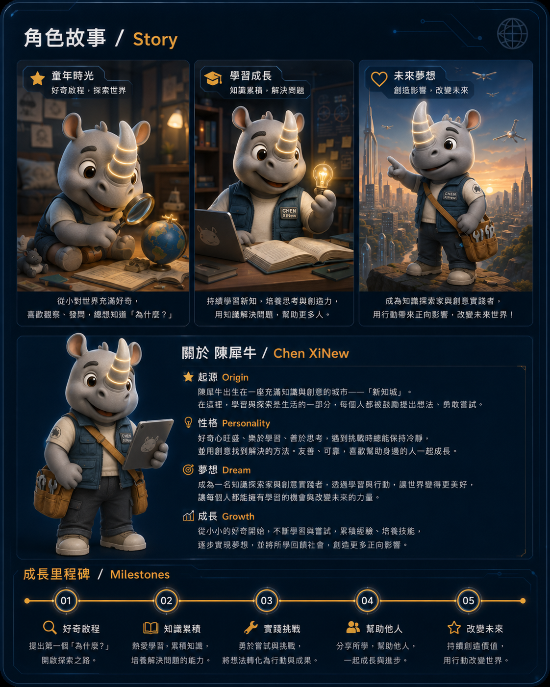
</div>

- **起源 Origin**：陳犀牛出生在一座充滿知識與創意的城市——「**新知城**」。在這裡，學習與探索是生活的一部分，每個人都被鼓勵提出想法、勇敢嘗試。
- **成長環境 Background**：出生於一個充滿愛與支持的家庭，爸爸是工程師、媽媽是老師；從小喜歡拆解玩具、觀察動物、探索自然與科技。
- **夢想 Dream**：成為一名知識探索家與創意實踐者，透過學習與行動，讓世界變得更美好，讓每個人都能擁有學習的機會與改變未來的力量。

### 成長里程碑 Milestones

| 階段 | 年份 | 里程碑 |
|---|---|---|
| 01 | 2015 | **好奇啟程** — 提出第一個「為什麼？」，開啟探索之路 |
| 02 | 2018 | **小小發明家** — 熱愛學習、累積知識，培養解決問題的能力 |
| 03 | 2020 | **知識分享者** — 勇於嘗試與挑戰，將想法轉化為行動與成果 |
| 04 | 2023 | **科普創作者** — 分享所學、幫助他人，一起成長與進步 |
| 05 | 未來 | **改變未來** — 持續創造價值，用行動改變世界 |

---

## 內容策略 Content Strategy

### 內容五大主題 Content Pillars

<div align="center">
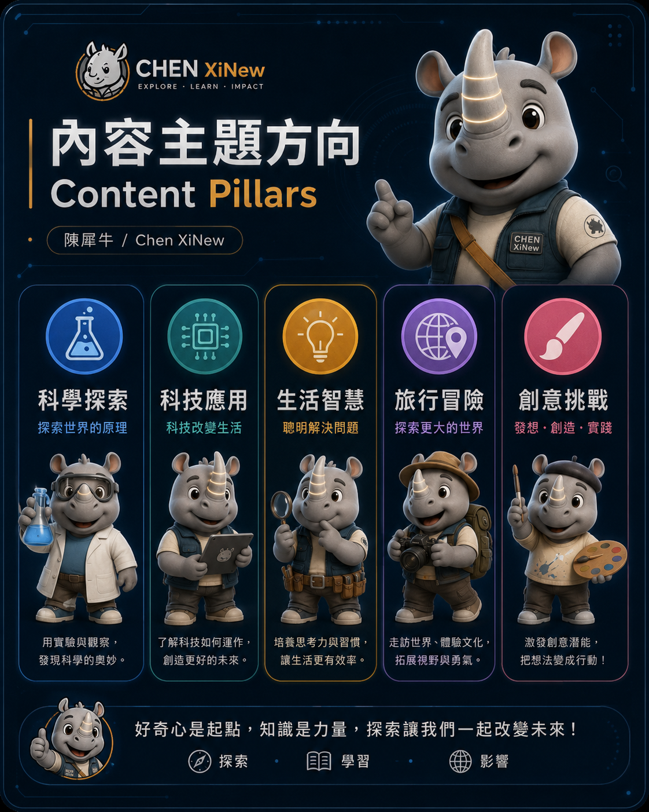
</div>

| 主題 Pillar | 標語 | 說明 |
|---|---|---|
| 🧪 **科學探索 Science** | 探索世界的原理 | 用實驗與觀察，發現科學的奧妙 |
| 💻 **科技應用 Technology** | 科技改變生活 | 了解科技如何運作，創造更好的未來 |
| 💡 **生活智慧 Life** | 聰明解決問題 | 培養思考力與習慣，讓生活更有效率 |
| 🌐 **旅行冒險 Travel** | 探索更大的世界 | 走訪世界、體驗文化，拓展視野與勇氣 |
| 🎨 **創意挑戰 Creativity** | 發想 · 創造 · 實踐 | 激發創意潛能，把想法變成行動 |

### 影音 / 動畫模板 Animation & Video Templates

角色動畫採「明亮、活潑、科技感結合日常生活」的風格，並提供標準化的 **5 步驟片頭分鏡** 與 **手勢動作集**，方便系列影片維持一致的視覺語言：

`① LOGO 出現 → ② 角色登場 → ③ 理念呈現 → ④ 專業展現 → ⑤ 收尾定格`

> 詳見 [`animation-video-templates.png`](assets/05-content-strategy/animation-video-templates.png)。

### 頻道視覺應用 Channel Visual Templates

包含 YouTube 頻道橫幅、頻道大頭貼與影片縮圖範例，維持頻道品牌一致性。

- **頻道帳號 Handle**：`@ChenXiNew`
- **社群 Social**：YouTube `xinew-says`　·　Instagram `@chen.rhino`　·　Facebook `陳犀牛 Chen XiNew`

> 詳見 [`channel-visual-templates.png`](assets/05-content-strategy/channel-visual-templates.png)。

---

## 主題曲 Theme Song

### 《犀牛角亮起來》 — 陳犀牛開場主題曲

角色專屬的開場主題曲，用於影片片頭、頻道包裝與活動登場。曲風明亮、節奏輕快，副歌以「陳犀牛 陳犀牛 動動腦 動動手」的呼喊式重複句設計，方便記憶與跟唱；結尾收在品牌標語 **知識・探索・改變** 與口頭禪 **「發現問題，解決問題，然後讓世界更好！」**，與 [品牌識別](#品牌識別-brand-identity) 一致。

### 版本 Versions

共提供 **一長一短兩個版本**，依使用場景選用：

| 版本 | 長度 | 檔案 | 段落結構 | 建議用途 |
|---|---|---|---|---|
| **短版 Short** | 60 秒 | [`陳犀牛開場主題曲_犀牛角亮起來_1Min.m4a`](assets/陳犀牛開場主題曲_犀牛角亮起來_1Min.m4a) | Intro → Verse → Chorus → Outro | 影片片頭、社群短影音、Reels / Shorts、廣告墊底 |
| **長版 Full** | 120 秒 | [`陳犀牛開場主題曲_犀牛角亮起來_2Min.mp4`](assets/陳犀牛開場主題曲_犀牛角亮起來_2Min.mp4) | Intro → Verse 1 → Chorus → Verse 2 → Chorus → Bridge → Chorus → Outro | 完整主題曲 MV、活動開場、頻道介紹片、演出播放 |

> **格式說明**：兩個檔案皆為 **AAC 音訊（ISO Media / M4A）**。長版雖以 `.mp4` 為副檔名，實際上**僅含音訊軌、不含影像**，播放器會以純音訊開啟。
>
> **兩版關係**：短版並非長版的剪輯片段，而是獨立混音的精簡版；兩者共用同一段 Intro、Chorus 與 Outro，長版另外多出 Verse 2 與 Bridge。

### 歌詞 Lyrics

歌詞原始檔（RTF）：[`1min歌詞.rtf`](assets/1min歌詞.rtf)　·　[`2min歌詞.rtf`](assets/2min歌詞.rtf)

<details>
<summary><b>短版歌詞（60 秒）</b></summary>

```text
[Intro]
(嘿！嘿！)
犀牛角亮起來囉～

[Verse]
揹起工具包 平板手上拿
工裝背心穿好啦 出發去探險
打開課本之前 先問一個為什麼
好奇心是燃料 帶我往前跑

[Chorus]
陳犀牛 陳犀牛 動動腦 動動手
發現問題 解決問題 世界變更好
陳犀牛 陳犀牛 一起學 一起笑
用好奇心探索世界 用知識改變未來！
Stay Curious, Keep Growing!

[Outro]
發現問題 解決問題 然後讓世界更好！
知識・探索・改變
(陳犀牛！)
上課囉！
```

</details>

<details>
<summary><b>長版歌詞（120 秒）</b></summary>

```text
[Intro]
(嘿！嘿！)
犀牛角亮起來囉～

[Verse 1]
揹起工具包 平板手上拿
工裝背心穿好啦 出發去探險
打開課本之前 先問一個為什麼
好奇心是燃料 帶我往前跑

[Chorus]
陳犀牛 陳犀牛 動動腦 動動手
發現問題 解決問題 世界變更好
陳犀牛 陳犀牛 一起學 一起笑
用好奇心探索世界 用知識改變未來！
Stay Curious, Keep Growing!

[Verse 2]
科學科技 生活智慧 旅行創意全包
新知城的朋友們 集合時間到
不怕錯 勇敢試 答案就在路上找
小小發明家 是我們的代號

[Chorus]
陳犀牛 陳犀牛 動動腦 動動手
發現問題 解決問題 世界變更好
陳犀牛 陳犀牛 一起學 一起笑
用好奇心探索世界 用知識改變未來！
Stay Curious, Keep Growing!

[Bridge]
(一、二、三、四！)
發光的角 照亮每一個問號
把複雜變簡單 讓學習變冒險
你就是下一個探索家 準備好！

[Chorus]
陳犀牛 陳犀牛 動動腦 動動手
發現問題 解決問題 世界變更好
陳犀牛 陳犀牛 一起學 一起笑
用好奇心探索世界 用知識改變未來！

[Outro]
發現問題 解決問題 然後讓世界更好！
知識・探索・改變
(陳犀牛！)
上課囉！
```

</details>

### 歌詞與品牌設定的對應 Lyric ↔ Brand Mapping

| 歌詞片段 | 對應設定 |
|---|---|
| 「犀牛角亮起來囉～」 | 造型特徵：**發光犀牛角**（靈感與探索之光） |
| 「揹起工具包 平板手上拿 / 工裝背心穿好啦」 | 造型特徵：**工裝背心 + 側背工具包 + 手持平板** |
| 「科學科技 生活智慧 旅行創意全包」 | [內容五大主題](#內容策略-content-strategy)：科學 / 科技 / 生活 / 旅行 / 創意 |
| 「新知城的朋友們」 | 世界觀起源地：**新知城** |
| 「小小發明家 是我們的代號」 | 成長里程碑 02：**小小發明家（2018）** |
| 「用好奇心探索世界 用知識改變未來！」 | 品牌主標語 Headline |
| 「知識・探索・改變」 | 品牌標語 Tagline（EXPLORE · LEARN · IMPACT） |
| 「Stay Curious, Keep Growing!」 | 頻道口號 Channel Slogan |
| 「發現問題 解決問題 然後讓世界更好！」 | 角色口頭禪 Catchphrase |

### 使用建議 Usage Notes

- **片頭搭配**：短版對應動畫模板的 5 步驟片頭分鏡（`① LOGO → ② 角色登場 → ③ 理念 → ④ 專業 → ⑤ 定格`），Intro 的「犀牛角亮起來囉～」建議對齊犀牛角發光的動畫時間點。
- **副歌節錄**：需要 10–15 秒的極短版（如 Shorts 片頭、開場動態貼圖）時，建議直接節錄 Chorus 前兩句。
- **字幕與跟唱**：卡拉 OK 式字幕請以上方段落標記（Intro / Verse / Chorus / Bridge / Outro）切分，維持與歌詞原始檔一致。
- **音量與混音**：作為配樂墊底時建議降至 -18 dB 上下，避免蓋過旁白；片頭獨奏段落可回到 -6 dB。

---

## 設計資產索引 Asset Index

> 視覺素材皆為 PNG 格式，收錄於 `assets/` 下對應分類資料夾，點擊檔名即可預覽；主題曲音檔與歌詞則直接放在 `assets/` 根目錄（音檔請點擊後下載或於播放器開啟，GitHub 頁面無法直接試聽）。

### 01 · 品牌識別 Brand Identity

| 預覽 | 檔案 | 說明 |
|---|---|---|
|  | [`brand-identity-logo-color-system.png`](assets/01-brand-identity/brand-identity-logo-color-system.png) | 主標誌、頭像圖示、文字標誌、品牌色彩與標語系統 |

### 02 · 角色設計 Character Design

| 預覽 | 檔案 | 說明 |
|---|---|---|
| 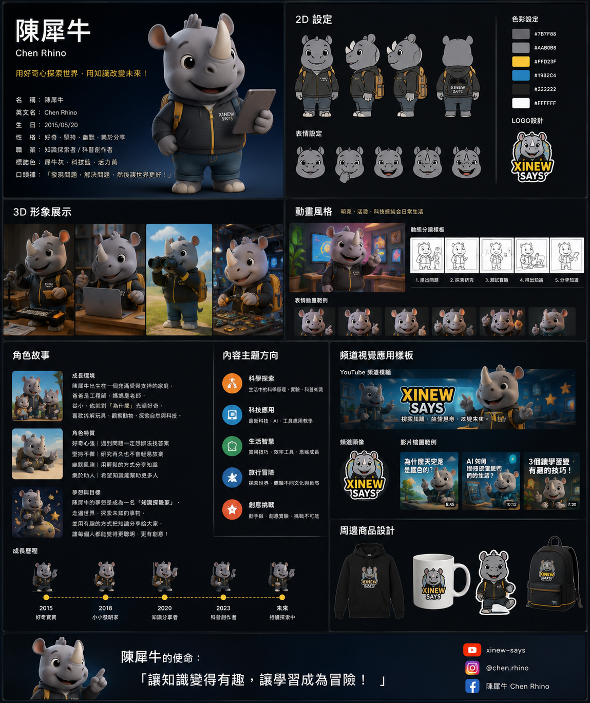 | [`character-bible-master.png`](assets/02-character-design/character-bible-master.png) | 角色設定總表（總覽：基本資料、2D/3D、動畫、故事、周邊） |
|  | [`key-visual-hero.png`](assets/02-character-design/key-visual-hero.png) | 主視覺海報：角色定位、性格、專長、使命、目標、座右銘 |
| 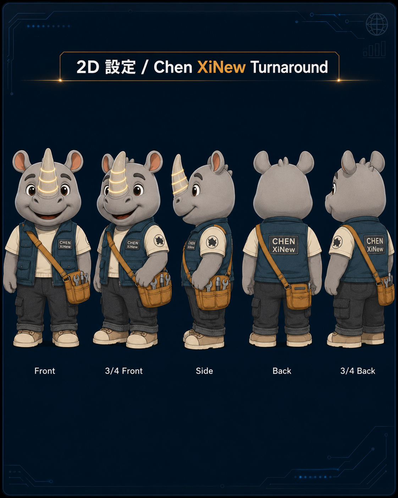 | [`2d-turnaround.png`](assets/02-character-design/2d-turnaround.png) | 2D 三視圖（Front / 3-4 Front / Side / Back / 3-4 Back） |
| 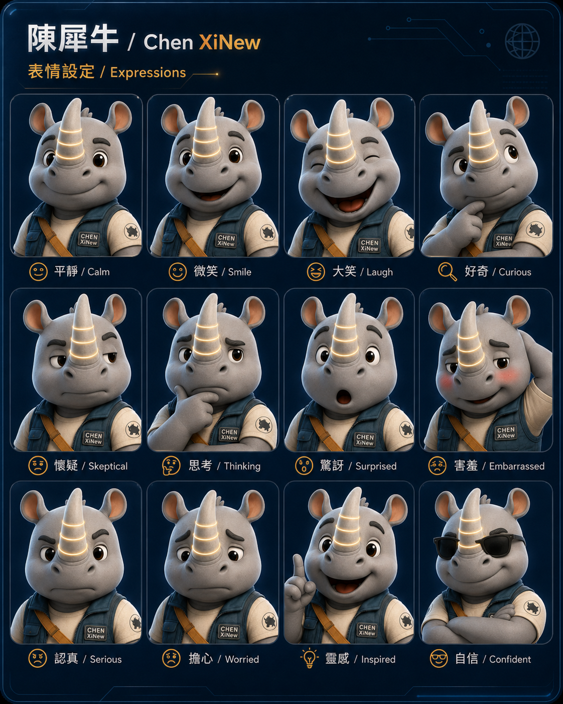 | [`expression-sheet.png`](assets/02-character-design/expression-sheet.png) | 12 種表情設定（平靜、微笑、大笑、好奇、懷疑、思考、驚訝、害羞、認真、擔心、靈感、自信） |

### 03 · 故事世界觀 Story & World

| 預覽 | 檔案 | 說明 |
|---|---|---|
|  | [`character-story-milestones.png`](assets/03-story-world/character-story-milestones.png) | 角色故事（童年 / 成長 / 未來）與成長里程碑 |

### 04 · 3D 展示 3D Showcase

| 預覽 | 檔案 | 說明 |
|---|---|---|
| 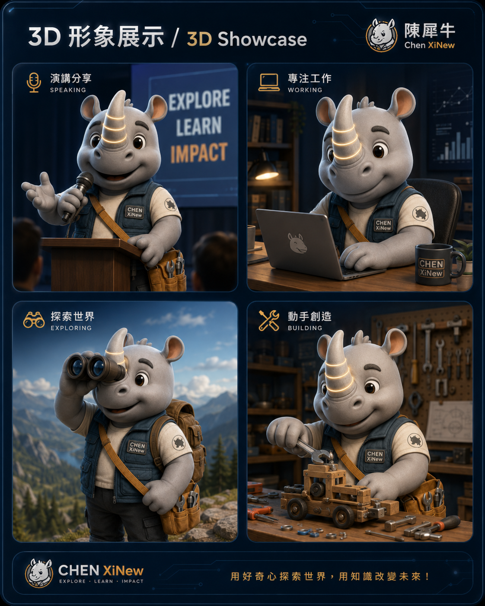 | [`3d-scene-showcase.png`](assets/04-3d-showcase/3d-scene-showcase.png) | 3D 情境展示（演講分享 / 專注工作 / 探索世界 / 動手創造） |

### 05 · 內容策略 Content Strategy

| 預覽 | 檔案 | 說明 |
|---|---|---|
|  | [`content-pillars.png`](assets/05-content-strategy/content-pillars.png) | 內容五大主題方向 |
| 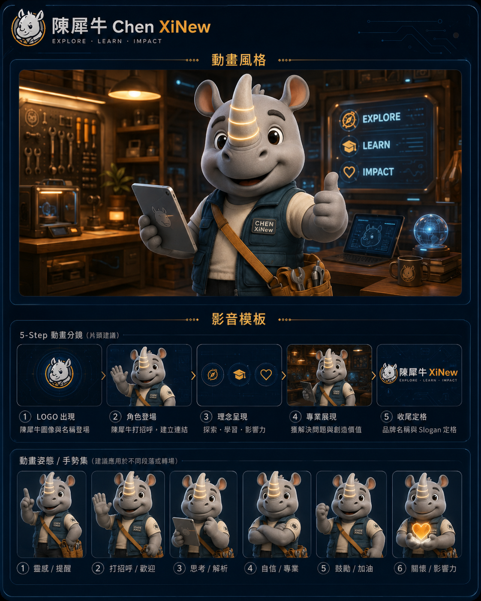 | [`animation-video-templates.png`](assets/05-content-strategy/animation-video-templates.png) | 動畫風格、5 步驟片頭分鏡、手勢動作集 |
| 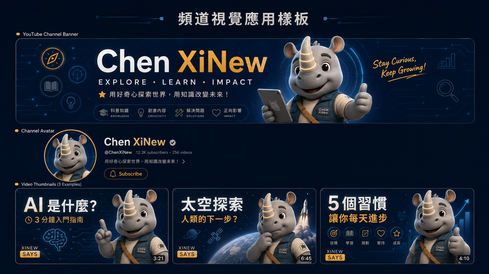 | [`channel-visual-templates.png`](assets/05-content-strategy/channel-visual-templates.png) | YouTube 頻道橫幅、大頭貼、影片縮圖範例 |

### 06 · 周邊商品 Merchandise

| 預覽 | 檔案 | 說明 |
|---|---|---|
| 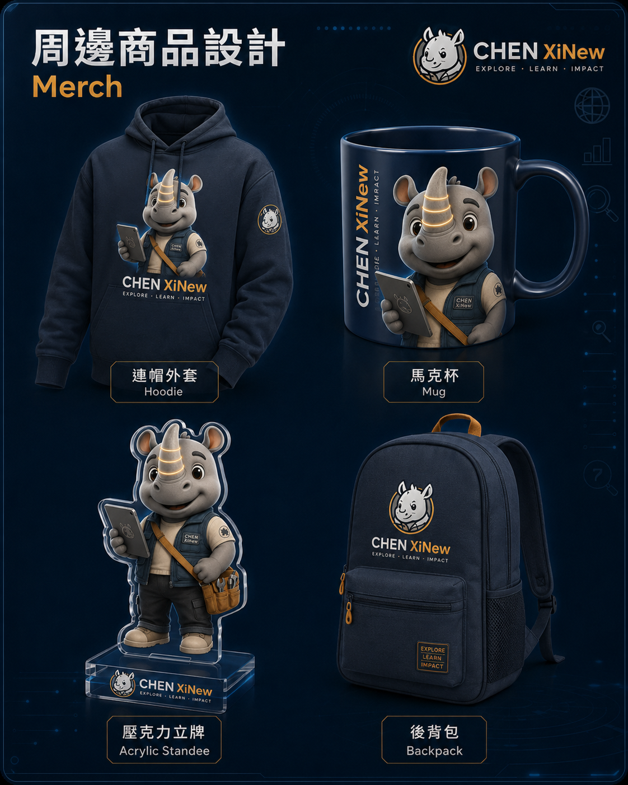 | [`merchandise-design.png`](assets/06-merchandise/merchandise-design.png) | 周邊設計（連帽外套 / 馬克杯 / 壓克力立牌 / 後背包） |

### 07 · 主題曲 Theme Song

| 類型 | 檔案 | 說明 |
|---|---|---|
| 🎵 音檔 | [`陳犀牛開場主題曲_犀牛角亮起來_1Min.m4a`](assets/陳犀牛開場主題曲_犀牛角亮起來_1Min.m4a) | 《犀牛角亮起來》**短版**，60 秒，AAC 音訊 |
| 🎵 音檔 | [`陳犀牛開場主題曲_犀牛角亮起來_2Min.mp4`](assets/陳犀牛開場主題曲_犀牛角亮起來_2Min.mp4) | 《犀牛角亮起來》**長版**，120 秒，AAC 音訊（無影像軌） |
| 📝 歌詞 | [`1min歌詞.rtf`](assets/1min歌詞.rtf) | 短版歌詞原始檔（RTF） |
| 📝 歌詞 | [`2min歌詞.rtf`](assets/2min歌詞.rtf) | 長版歌詞原始檔（RTF） |

> 歌詞全文請見 [主題曲 Theme Song](#主題曲-theme-song)。

---

## 檔案樹 File Tree

```text
XiNewIPs/
├── README.md                          # 本文件：IP 總覽與資產索引
└── assets/                            # 設計資產庫
    ├── 01-brand-identity/            # 品牌識別
    │   └── brand-identity-logo-color-system.png
    ├── 02-character-design/          # 角色設計
    │   ├── character-bible-master.png       # 角色設定總表
    │   ├── key-visual-hero.png              # 主視覺海報
    │   ├── 2d-turnaround.png                # 2D 三視圖
    │   └── expression-sheet.png             # 12 種表情
    ├── 03-story-world/               # 故事與世界觀
    │   └── character-story-milestones.png
    ├── 04-3d-showcase/               # 3D 情境展示
    │   └── 3d-scene-showcase.png
    ├── 05-content-strategy/          # 內容策略
    │   ├── content-pillars.png              # 內容五大主題
    │   ├── animation-video-templates.png    # 動畫 / 影音模板
    │   └── channel-visual-templates.png     # 頻道視覺樣板
    ├── 06-merchandise/               # 周邊商品
    │   └── merchandise-design.png
    │
    ├── 陳犀牛開場主題曲_犀牛角亮起來_1Min.m4a   # 主題曲短版（60 秒）
    ├── 陳犀牛開場主題曲_犀牛角亮起來_2Min.mp4   # 主題曲長版（120 秒，純音訊）
    ├── 1min歌詞.rtf                              # 短版歌詞
    └── 2min歌詞.rtf                              # 長版歌詞
```

### 命名原則 Naming Convention

- 資料夾採 `序號-分類` 命名（如 `02-character-design`），確保排序穩定、分類清楚。
- 檔名採**英文小寫 + 連字號（kebab-case）**，語意化描述內容，方便程式引用與跨平台相容。
- 新增素材時，請放入對應分類資料夾，並在 [設計資產索引](#設計資產索引-asset-index) 補上一列。
- **例外**：主題曲音檔與歌詞目前沿用中文原始檔名、並直接放在 `assets/` 根目錄。若日後要與上述規則對齊，建議移至 `assets/07-theme-song/` 並改名為 `theme-song-1min.m4a` / `theme-song-2min.m4a` / `lyrics-1min.rtf` / `lyrics-2min.rtf`（同時更新本文件連結）。

---

## 使用指引 Usage Guidelines

### ✅ 建議做法 Do

- 維持品牌主色 **探索橙 `#F5A623`** 作為強調色，深藍系作為主背景。
- 使用時保留角色的核心識別特徵：**發光犀牛角、工裝背心、名牌、犀牛臂章**。
- 標語搭配優先使用「知識 · 探索 · 改變 / EXPLORE · LEARN · IMPACT」。
- 系列影片片頭固定使用主題曲《犀牛角亮起來》，短影音用短版、完整節目用長版，建立聽覺記憶點。
- 引用素材時使用本庫的檔案路徑，避免各處各自存放造成版本混亂。

### ⛔ 避免 Don't

- 請勿任意更改角色比例、膚色或角的造型，以免失去識別度。
- 請勿在同一畫面混用過多高彩度色，維持整體科技質感。
- 請勿將 Logo 變形、加陰影或改色（高光橙除外）。

### 🔗 引用範例 Reference Example

```markdown
<!-- Markdown 引用主視覺 -->

```

```html
<!-- HTML 引用頭像 Logo -->

```

---

<div align="center">

**陳犀牛 Chen XiNew** — 讓知識變得有趣，讓學習成為冒險！

*Stay Curious, Keep Growing.*

</div>
